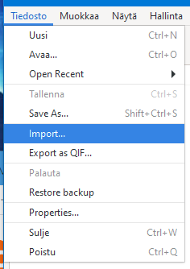
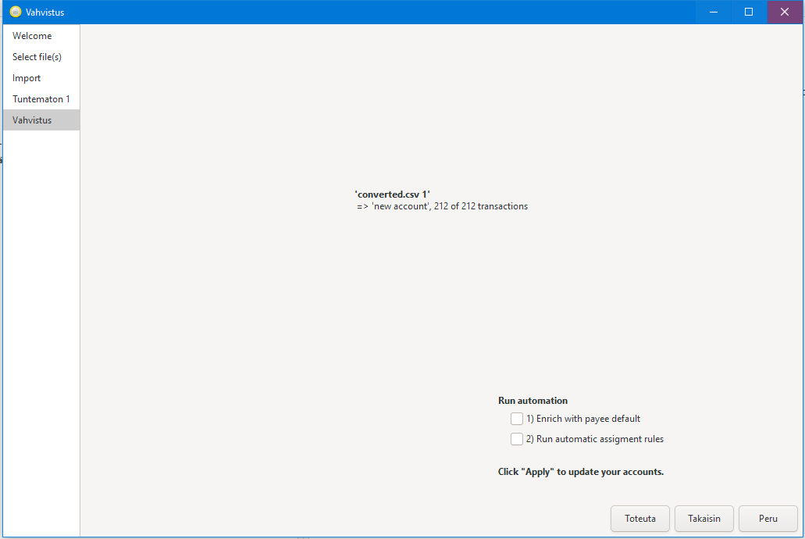

# Siirrä OP-tilitapahtumat HomeBank-sovellukseen

## 1. Lataa CSV-muotoinen tiedosto OP-verkkopankista


* Valitse "Tulosta tilotteita"


* Valitse "Tapahtumat ajalta". Suosituksena viedä tiedot vuosittain, jolloin tietoja on myös helppo hallita HomeBank-sovelluksessa.


* Valitse "Lataa pelkät tilitapahtumat tiedostona"

## 2. Muunna HomeBank:n ymmärtämään CSV-tiedostomuotoon

```
python .\tapahtumat_parser.py .\tapahtumat20190101-20191231.csv
```

Tästä muodostuu uusi tiedosto `converted.csv` ja tätä tiedostoa HomeBank suostuu syömään.

## 3. Tuo HomeBank sovellukseen tiedosto



 * Valitse tiedosto.


 * Valitse seuraava.


* Muista valita "Import this file into" kohtaan valita "<New account>" jos haluat tehdä tilit vuosittaisiksi.
* Muista valita kohtaan "Päiväjärjestys" valinnaksi "y-m-d".



* Ja valitse "Toteuta"

## 4. Korjaa tilin aloitussaldo


* Valitse "Avaa tiliote omaan ikkunaansa"


* Kopioi punaisella merkitty summa, eli tilinotteen alussa ollut saldo.

* Valitse HomeBank-sovelluksesta "Hallitse tilejä"


* Syötä aloitus saldo kenttään "Start balance".

## Valmista tuli!